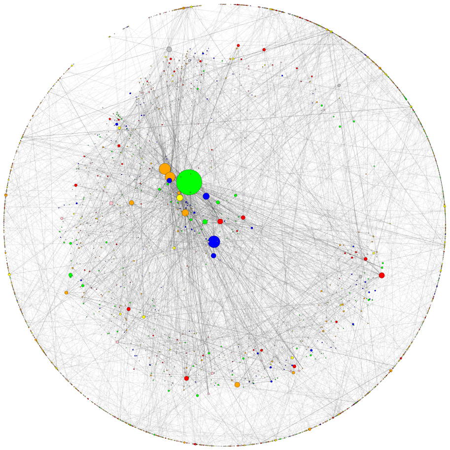

## GAT - Graph Attention Network (PyTorch) :computer: + graphs + :mega: = :heart:
This repo contains PyTorch implementation of the original GAT paper (:link: [Veličković et al.](https://arxiv.org/abs/1710.10903)). <br/>
It's aimed at making it **easy to start playing and learning** about GAT and GNNs in general. <br/>

## Table of Contents
* [What are graph neural networks and GAT?](#what-are-gnns)
* [Setup](#setup)
* [Usage](#usage)
* [Hardware requirements](#hardware-requirements)
* [Learning material](#video-learning-material)
    
## What are GNNs?

Graph neural networks are a family of neural networks that are dealing with signals defined over graphs!

Graphs can model many interesting natural phenomena so you'll see them used everywhere from:
* Computational biology - predicting potent [antibiotics like halicin](https://www.nature.com/articles/d41586-020-00018-3)
* Computational pharmacology - predicting [drug side effects](https://arxiv.org/abs/1802.00543)
* Traffic forecasting - e.g. it's used in [Google Maps](https://deepmind.com/blog/article/traffic-prediction-with-advanced-graph-neural-networks)
* Recommendation systems (used at [Pintrest](https://medium.com/pinterest-engineering/pinsage-a-new-graph-convolutional-neural-network-for-web-scale-recommender-systems-88795a107f48), [Uber](https://eng.uber.com/uber-eats-graph-learning/), [Twitter](https://towardsdatascience.com/temporal-graph-networks-ab8f327f2efe), etc.) 

and all the way to [particle physics](https://news.fnal.gov/2020/09/the-next-big-thing-the-use-of-graph-neural-networks-to-discover-particles/) in Large Hedron Collider [(LHC)](https://en.wikipedia.org/wiki/Large_Hadron_Collider), [fake news detection](https://arxiv.org/abs/1902.06673) and the list goes on and on!

GAT is a representative of spatial (convolutional) GNNs. Since CNNs had a tremendous success in the field of computer vision,
researchers decided to generalize it to graphs and here we are! :nerd_face:

Here is a schematic of GAT's structure:

<p align="center">

</p>

## Cora visualized

You can't just start talking about GNNs without mentioning the single most famous graph dataset - the **Cora citation network**.

Nodes in Cora represent research papers and the links are, you guessed it, citations between those papers.

I've added a utility for visualizing Cora and doing basic network analysis, here is how Cora looks like:

<p align="center">

</p>

Node size corresponds to it's degree (i.e. the number of in/out going edges). Edge thickness roughly corresponds
to how "popular" or "connected" that edge is (**edge betweennesses** is the nerdy term [check out the code](https://github.com/gordicaleksa/pytorch-GAT/blob/main/utils/visualizations.py#L104).)

And here is a plot showing the degree distribution on Cora:

<p align="center">

</p>

In and out degree plots are the same since we're dealing with an undirected graph. 

On the bottom plot (degree distribution) you can see an interesting peak happening in the `[2, 4]` range.
Tha means that the majority of nodes have a small number of edge but there is 1 node that has 169 edges! (the big green node in the previous plot)

## Attention visualized

Once we have a fully-trained GAT model we can visualize the attention that certain nodes have learned.
Nodes use attention to decide how to aggregate their neighborhood, enough talk, let's see it:

<p align="center">

</p>

This is one of Cora's nodes that has the most edges (citations). The colors represent the nodes of the same class.
You can clearly see 2 things from this plot:
* The graph is [homophilic](https://en.wikipedia.org/wiki/Homophily) meaning similar nodes (nodes with same class) tend to cluster together.
* Edge thickness on this chart is a function of attention, and since they are all of the same thickness, GAT basically learned to do something similar to [GCN!](https://www.youtube.com/watch?v=VyIOfIglrUM)

Similar rules hold for smaller neighborhoods. Also notice the self edges:

<p align="center">

</p>

## Analyzing Cora's embedding space (t-SNE)

Ok, we've seen attention! What else is there to visualize? Well, let's visualize the learned embeddings from GAT's
last layer. The output of GAT is a tensor of shape = (2708, 7) where 2708 is the number of nodes in Cora and 7 is
the number of classes. Once we project those 7-dim vectors into 2D, using t-SNE, we get this:

<p align="center">

</p>

We can see that nodes with same label/class are roughly **clustered together** - with these representations it's easy
to train a simple classifier on top that will tell us which class the node belongs to.

*Note: I've tried UMAP as well but didn't get nicer results + it has a lot of dependencies if you want to use their plot util.*

## Setup

So we talked about what GNNs are, and what they can do for you (among other things). <br/>
Let's get this thing running! Follow the next steps:

1. `git clone https://github.com/gordicaleksa/pytorch-GAT`
2. Open Anaconda console and navigate into project directory `cd path_to_repo`
3. Run `conda env create` from project directory (this will create a brand new conda environment).
4. Run `activate pytorch-gat` (for running scripts from your console or setup the interpreter in your IDE)

That's it! It should work out-of-the-box executing environment.yml file which deals with dependencies. <br/>

-----

PyTorch pip package will come bundled with some version of CUDA/cuDNN with it,
but it is highly recommended that you install a system-wide CUDA beforehand, mostly because of the GPU drivers. 
I also recommend using Miniconda installer as a way to get conda on your system.
Follow through points 1 and 2 of [this setup](https://github.com/Petlja/PSIML/blob/master/docs/MachineSetup.md)
and use the most up-to-date versions of Miniconda and CUDA/cuDNN for your system.

## Usage
story on 3 imps

### Evaluating and profiling GAT
profiling info
GAT achieves `~83%` accuracy on test nodes.

### Tracking using Tensorboard

## Hardware requirements

GAT doesn't require super strong HW, especially not if you just want to play with Cora. With 2+ GBs GPU you're good to go.

It takes (on Cora citation network):
* ~10 seconds to train on my RTX 2080 GPU
* 1.5 GBs of VRAM memory is *reserved* (PyTorch's caching overhead - far less is allocated for the actual tensors)
* The model itself has only 365 KBs!

Compare this to hardware needed even for the smallest of [transformers](https://github.com/gordicaleksa/pytorch-original-transformer#hardware-requirements)!

### Future todos:

* Add jupyter notebook (coming soon)
* Add inductive example
* Potentially dd implementation leveraging PyTorch's sparse API

The repo already has everything it needs for learning purposes, these are just the bonus points. I've tested everything
from environment setup, to graph visualizations, etc.

If you have an idea of how to implement GAT using PyTorch's sparse API please feel free to submit a PR.
I personally had difficulties with their API, it's in beta, and it's questionable whether it's at all possible
to make an implementation as efficient as my implementation 3 using it.

## Video learning material

If you're having difficulties understanding GAT I did an in-depth overview of the paper [in this video:](https://www.youtube.com/watch?v=uFLeKkXWq2c&ab_channel=TheAIEpiphany)

<p align="left">
<a href="https://www.youtube.com/watch?v=uFLeKkXWq2c" target="_blank"></a>
</p>

I have some more videos which could further help you understand GNNs:
* [My overview of the GCN paper](https://www.youtube.com/watch?v=VyIOfIglrUM)
* [My overview of the GraphSAGE paper](https://www.youtube.com/watch?v=vinQCnizqDA)
* [My overview of the PinSage paper](https://www.youtube.com/watch?v=ed0NJdqwEyg)
* [My overview of Temporal Graph Networks (TGN)](https://www.youtube.com/watch?v=0tw66aTfWaI)

## Acknowledgements

I found these repos useful (while developing this one):

* [official GAT](https://github.com/PetarV-/GAT) and [GCN](https://github.com/tkipf/gcn)
* [PyTorch Geometric](https://github.com/rusty1s/pytorch_geometric)
* [DeepInf](https://github.com/xptree/DeepInf) and [pyGAT](https://github.com/Diego999/pyGAT)

## Citation

If you find this code useful, please cite the following:

```
@misc{Gordić2020PyTorchGAT,
  author = {Gordić, Aleksa},
  title = {pytorch-GAT},
  year = {2020},
  publisher = {GitHub},
  journal = {GitHub repository},
  howpublished = {\url{https://github.com/gordicaleksa/pytorch-GAT}},
}
```

## Licence

[](https://github.com/gordicaleksa/pytorch-GAT/blob/master/LICENCE)